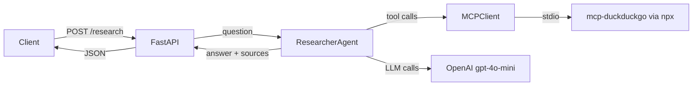

# IndiaVC — AI-Powered Startup Due Diligence

> Multi-agent research system for the Indian startup ecosystem, built on FastAPI, OpenAI, and the Model Context Protocol.

## What it does

IndiaVC automates the research phase of venture capital due diligence for Indian startups. Submit a research question and the system dispatches an AI agent that searches the web, synthesizes findings, and returns a cited answer — all via a simple REST API.

## Tech Stack

| Layer | Technology |
|---|---|
| API | FastAPI 0.115+ |
| LLM | OpenAI gpt-4o / gpt-4o-mini |
| Web Search | DuckDuckGo via MCP (`mcp-duckduckgo`) |
| MCP Client | `mcp` Python SDK (stdio transport) |
| Config | Pydantic Settings v2 |
| Logging | structlog (JSON) |
| Runtime | Python 3.12 + Node 20 (for npx MCP servers) |

## Architecture



## Quick Start

```bash
# 1. Clone and enter
git clone https://github.com/varunbommagunta/indiavc
cd indiavc

# 2. Create .env (copy and fill in)
cp .env.example .env
# edit .env -- add your OPENAI_API_KEY

# 3. Create venv and install
python -m venv venv
# Windows:
.\venv\Scripts\activate
# Mac/Linux:
source venv/bin/activate

pip install -r requirements.txt

# 4. Run
uvicorn api.main:app --reload

# 5. Research
curl -X POST http://localhost:8000/research \
  -H "Content-Type: application/json" \
  -d '{"question": "What is the funding history of Razorpay?"}'
```

## Running Tests

```bash
pytest tests/ -v
```

## Project Status

**Week 1 of 6 -- Foundation**

- [x] FastAPI scaffold with `/health` and `/research` endpoints
- [x] MCP client (stdio transport, mcp-duckduckgo)
- [x] Researcher agent with OpenAI tool-calling loop
- [x] Pydantic Settings v2 config
- [x] structlog JSON logging
- [ ] Week 2: Multi-agent orchestration (Orchestrator + Critic)
- [ ] Week 3: LLM router + guardrails + HITL
- [ ] Week 4: Frontend dashboard
- [ ] Week 5: Custom MCP server + evaluation framework
- [ ] Week 6: Production hardening + deployment
