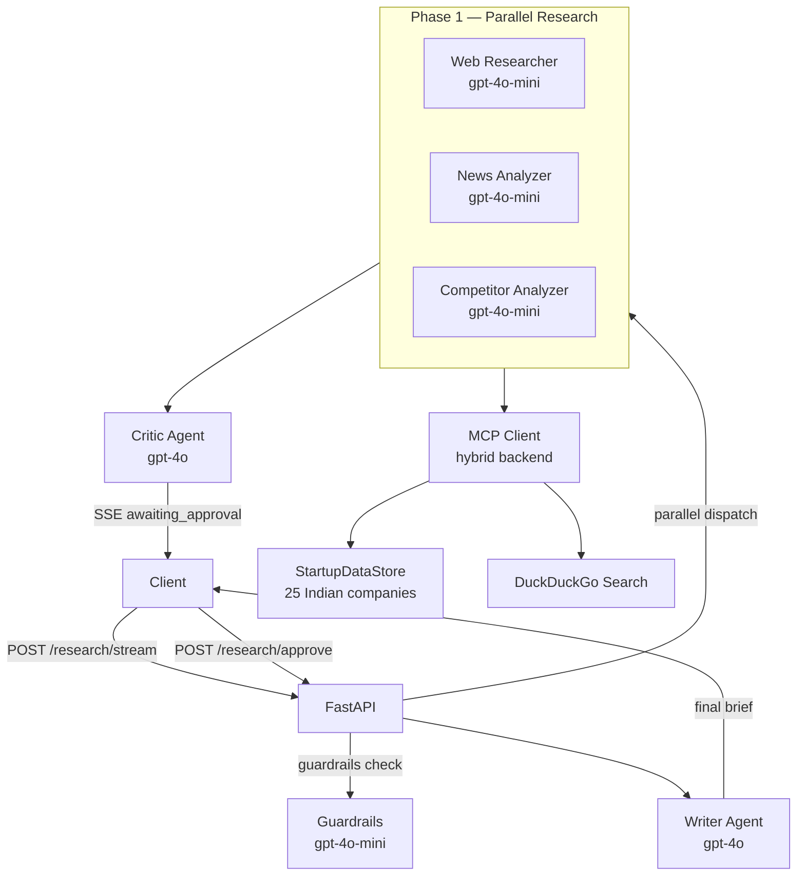

# IndiaVC — AI-Powered Indian Startup Due Diligence

> Multi-agent research system for the Indian startup ecosystem, built on FastAPI, OpenAI, and the Model Context Protocol.

**Live demo:** [Hugging Face Space](https://huggingface.co/spaces/varunbommagunta/indiavc) | **Frontend:** [indiavc.vercel.app](https://indiavc.vercel.app)

---

## What it does

IndiaVC automates the research phase of venture capital due diligence for Indian startups. Submit a company name or research question; five specialized AI agents run in parallel to synthesize a structured investor brief with funding history, competitive landscape, bull/bear cases, and cited sources.

---

## Evaluation Results

Tested against 8 real queries (well-known startups, comparisons, lesser-known companies):

| Dimension | Score (/10) |
|---|---|
| Overall | 8.29 |
| Completeness | 8.7 |
| Specificity | 7.9 |
| Balance | 8.5 |
| Citations | 7.8 |
| Accuracy | 8.6 |

- Avg duration: ~45s per brief
- Avg tool calls: 12 per query
- Guardrails: 100% harmful queries refused, 0% false positives on legitimate company research

---

## Architecture



**Agent roles:**
- **Web Researcher** — searches DuckDuckGo for funding, founders, and business model
- **News Analyzer** — finds recent news, controversies, and regulatory issues
- **Competitor Analyzer** — maps the competitive landscape using StartupDataStore + web search
- **Critic** — reviews all three outputs and flags gaps before the brief is written
- **Writer** — synthesizes everything into a structured Markdown investor brief

---

## Agentic Concepts Implemented

| # | Concept | Where |
|---|---|---|
| 1 | Multi-agent orchestration | `Orchestrator` dispatches 5 specialized agents |
| 2 | Parallel agent execution | Phase 1 runs Web/News/Competitor agents concurrently via `asyncio.gather` |
| 3 | Tool use / function calling | All research agents call MCP tools via OpenAI function-calling |
| 4 | Model Context Protocol (MCP) | Custom MCP server + DuckDuckGo MCP client |
| 5 | Custom MCP server | `StartupDataStore` serves 25 Indian companies as MCP tools |
| 6 | Hybrid MCP backend | In-process custom tools + external DuckDuckGo search |
| 7 | Human-in-the-loop (HITL) | SSE stream pauses at `awaiting_approval`; user approves before brief is written |
| 8 | Server-Sent Events streaming | Real-time agent progress streamed to frontend |
| 9 | LLM router | `HEAVY/MEDIUM/LIGHT` tiers: gpt-4o for Critic/Orchestrator, gpt-4o-mini for workers |
| 10 | Guardrails / safety classifier | gpt-4o-mini pre-screens queries; refuses harmful/off-topic requests |
| 11 | Structured output | All LLM calls use `response_format: json_object` where applicable |
| 12 | Critic / reflection pattern | Critic agent reviews research before human approval |
| 13 | Retrieval-augmented generation | MCP tools inject company data into agent context |
| 14 | Agent memory via context | Each agent receives prior agents' outputs as context |
| 15 | Evaluation framework | `scripts/evaluate_agents.py` with gpt-4o-mini as judge (5 dimensions) |
| 16 | Pydantic schemas | All API request/response models validated with Pydantic v2 |
| 17 | Structured logging | structlog JSON logs with per-agent trace fields |

---

## Tech Stack

| Layer | Technology |
|---|---|
| API | FastAPI 0.115+ |
| LLM | OpenAI gpt-4o (critic/writer) + gpt-4o-mini (workers/guardrails) |
| MCP | Custom Python server + DuckDuckGo (`mcp-duckduckgo`) |
| Frontend | Next.js 14, Tailwind CSS, shadcn/ui |
| Config | Pydantic Settings v2 |
| Logging | structlog (JSON) |
| Deployment | Hugging Face Spaces (Docker) + Vercel |
| Runtime | Python 3.12 + Node 20 |
| Tests | pytest + pytest-asyncio (52 tests) |

---

## Quick Start

```bash
# 1. Clone
git clone https://github.com/varunbommagunta/indiavc
cd indiavc

# 2. Create .env
cp .env.example .env
# Add your OPENAI_API_KEY and set MCP_BACKEND=hybrid

# 3. Install
python -m venv venv
source venv/bin/activate  # Windows: .\venv\Scripts\activate
pip install -r requirements.txt

# 4. Run backend
uvicorn api.main:app --reload
# API available at http://localhost:8000

# 5. Run frontend (optional)
cd ui
npm install
npm run dev
# UI available at http://localhost:3000
```

**Example request:**
```bash
# Start streaming research
curl -X POST http://localhost:8000/research/stream \
  -H "Content-Type: application/json" \
  -d '{"question": "Razorpay funding history"}' \
  --no-buffer

# Approve to generate brief (use session_id from stream)
curl -X POST http://localhost:8000/research/approve \
  -H "Content-Type: application/json" \
  -d '{"session_id": "<session_id_from_stream>"}'
```

---

## Project Structure

```
indiavc/
├── api/               # FastAPI app + schemas
├── src/
│   ├── agents/        # 5 specialized agents
│   ├── guardrails.py  # Safety classifier
│   ├── mcp/           # MCP client + custom server
│   └── utils/         # Logging, helpers
├── ui/                # Next.js frontend
├── config/            # Pydantic settings
├── scripts/           # Evaluation runner
├── data/eval/         # Eval dataset (10 test cases)
├── docs/              # Eval results, iteration log
├── tests/             # 52 pytest tests
└── Dockerfile         # HF Spaces deployment (port 7860)
```

---

## Running Tests

```bash
pytest tests/ -v  # 52 tests
```

---

## Known Limitations

- **Session store is in-memory**: HITL sessions are lost on server restart. A Redis store would be needed for production.
- **DuckDuckGo rate limits**: Heavy usage can hit DDGS rate limits; no retry logic implemented.
- **StartupDataStore is static**: 25 hardcoded companies. A database-backed store with regular updates would be more accurate.
- **LLM hallucination**: Briefs may contain inaccurate details, especially for lesser-known companies. Treat outputs as research starting points, not authoritative facts.
- **No authentication**: The API has no auth layer. Do not expose publicly without adding API key authentication.

---

## Iteration Log

See [`docs/ITERATION_LOG.md`](docs/ITERATION_LOG.md) for the full 6-week build history.

---

## License

MIT
